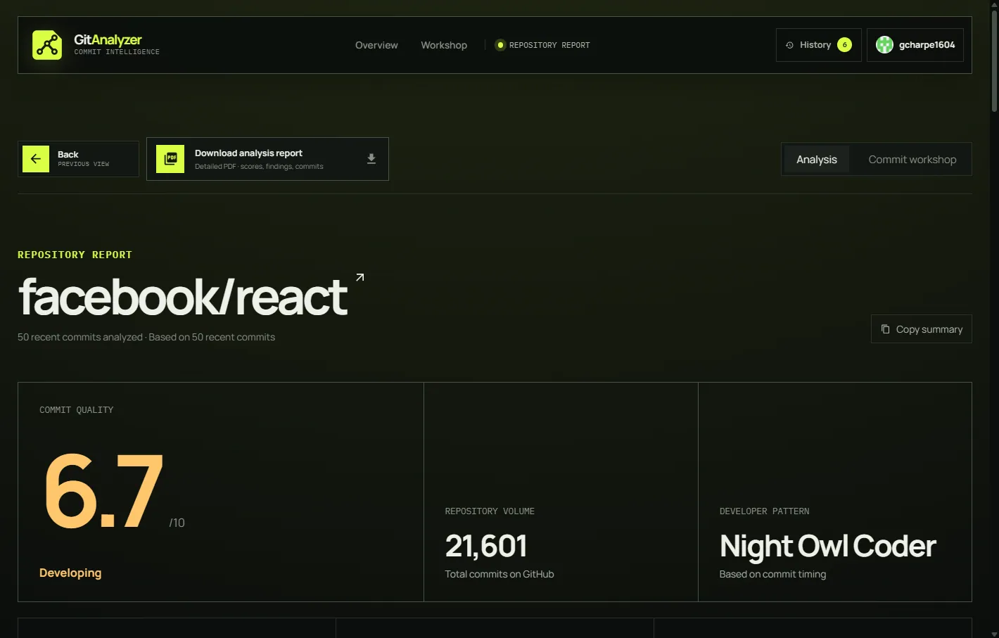
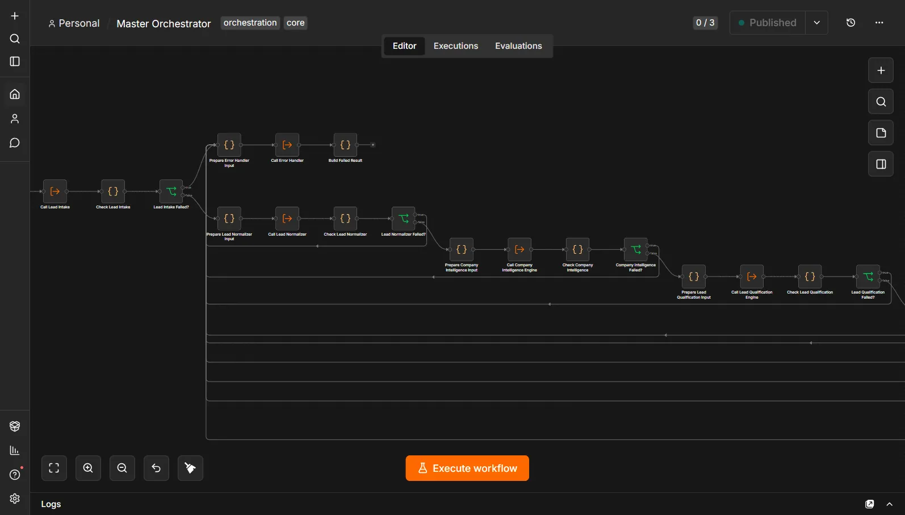
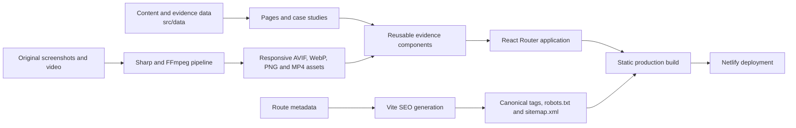

<div align="center">

# Working Proof

### Govind Charpe’s Engineering Portfolio

An evidence-first software engineering portfolio built around shipped products, system decisions, open-source contributions, and the artifacts that support them.

[](https://govind-charpe.netlify.app/)
[](https://react.dev/)
[](https://vite.dev/)
[](https://vitest.dev/)
[](https://www.netlify.com/)

[Live site](https://govind-charpe.netlify.app/) ·
[Open-source work](https://govind-charpe.netlify.app/open-source) ·
[Résumé](https://govind-charpe.netlify.app/resume) ·
[LinkedIn](https://www.linkedin.com/in/govind-charpe)

</div>

---

## Overview

This repository contains my personal software engineering portfolio.

Instead of presenting projects and skills as isolated claims, the portfolio connects them to inspectable proof: product interfaces, implementation decisions, architecture explanations, pull requests, review states, code diffs, terminal output, and documented trade-offs.

The portfolio focuses on three forms of engineering evidence:

* **Product** — complete interfaces and working software
* **System** — architecture, data flow, reliability boundaries, and implementation decisions
* **Review** — open-source pull requests, maintainer feedback, revisions, and contribution status

The application is a static React portfolio with build-time HTML for the homepage, case studies, open-source work, and résumé. React hydrates these pages for interactive navigation. It does not require a backend or private API credentials to run.

### Search and sharing

`npm run build` generates page-specific HTML, titles, descriptions, canonical URLs, structured data, `robots.txt`, and `sitemap.xml`, plus a `404.html` error page. Metadata lives in `src/data/seo.js`. Set `VITE_SITE_URL` to your permanent public origin when using a custom domain; otherwise the build uses Netlify's `URL` or `https://govind-charpe.netlify.app`. Deploy previews are marked `noindex` and excluded from the sitemap.

The included 1200 × 630 social previews use the existing project screenshots and portfolio identity. Regenerate them with `npm run assets:social` after changing the artwork. They are only referenced by sharing metadata and add no image downloads to normal page visits.

After deploying, submit `/sitemap.xml` in Google Search Console and inspect the homepage and both case-study URLs. Search Console ownership verification and live indexing checks require access to the site owner's account; a successful local build does not prove Google has indexed the site.

## Featured Engineering Work

<table>
  <tr>
    <td width="50%" valign="top">
      <a href="https://govind-charpe.netlify.app/work/gitanalyzer">
        
      </a>
      <br />
      <strong>GitAnalyzer</strong>
      <br />
      An explainable developer-feedback platform that analyzes recent GitHub commit history, separates quality signals, identifies recurring patterns, and provides repository-specific recommendations.
      <br /><br />
      <a href="https://govind-charpe.netlify.app/work/gitanalyzer">Read case study</a>
      ·
      <a href="https://gitanalyzer-ai.netlify.app/">Open product</a>
      ·
      <a href="https://github.com/gcharpe1604/gitanalyzer">View source</a>
    </td>
    <td width="50%" valign="top">
      <a href="https://govind-charpe.netlify.app/work/leadflow">
        
      </a>
      <br />
      <strong>LeadFlow</strong>
      <br />
      A configurable lead qualification and routing system with explicit validation, enrichment, deterministic and AI-assisted modes, fallback policies, review boundaries, and dispatcher planning.
      <br /><br />
      <a href="https://govind-charpe.netlify.app/work/leadflow">Read case study</a>
      ·
      <a href="https://github.com/gcharpe1604/ai-lead-qualification-agent">View source</a>
    </td>
  </tr>
</table>

## What Makes This Portfolio Different

### Evidence over claims

Skills are connected to the projects, pull requests, and systems where they were applied. The interface distinguishes demonstrated experience from technologies that are still being learned.

### Honest project status

A live product, working demo, merged contribution, approved pull request, and in-review change are not presented as equivalent achievements. Their actual status remains visible throughout the portfolio.

### Engineering decisions, not feature lists

The case studies explain:

* the problem being addressed
* intended users
* system architecture
* implementation responsibilities
* important technical decisions
* reliability boundaries
* testing considerations
* trade-offs and limitations
* next improvements

### Open-source work as a technical record

The open-source section is a filterable contribution ledger covering work in:

* **CNCF Harbor CLI**
* **Sugar Labs Music Blocks**

Each contribution remains connected to its upstream pull request and current review state.

## Application Routes

| Route                                                                     | Purpose                                                                |
| ------------------------------------------------------------------------- | ---------------------------------------------------------------------- |
| [`/`](https://govind-charpe.netlify.app/)                                 | Homepage, selected work, skills, open-source proof, about, and contact |
| [`/work/gitanalyzer`](https://govind-charpe.netlify.app/work/gitanalyzer) | Detailed GitAnalyzer product case study                                |
| [`/work/leadflow`](https://govind-charpe.netlify.app/work/leadflow)       | Detailed LeadFlow system case study                                    |
| [`/open-source`](https://govind-charpe.netlify.app/open-source)           | Filterable open-source contribution archive                            |
| [`/resume`](https://govind-charpe.netlify.app/resume)                     | Embedded résumé viewer with fullscreen and download controls           |

Routes are lazy-loaded and use a shared site layout for navigation, metadata, transitions, and footer content.

## Core Features

* Evidence-driven editorial homepage
* Interactive product and system walkthroughs
* Detailed project case studies
* Filterable open-source contribution ledger
* Organization and status filters stored in the URL
* Skills connected to implementation evidence
* Embedded résumé viewer
* Persistent dark and light themes
* Responsive desktop and mobile navigation
* Scroll progress and active-section tracking
* Custom proof-oriented cursor interactions
* Expandable evidence images with zoom controls
* Route transitions and motion-aware animations
* Dedicated not-found route
* Copy-to-clipboard contact interaction

## Architecture



The application separates content, presentation, and infrastructure concerns:

* `src/data` contains portfolio content, project records, contribution history, and evidence metadata.
* `src/components` contains reusable interaction and presentation systems.
* `src/pages` assembles those systems into routed experiences.
* `scripts/process-assets.mjs` creates optimized image and video variants.
* `vite.config.js` handles build-time SEO generation.
* `netlify.toml` defines deployment, SPA routing, and security headers.

## Technology Stack

| Area                   | Technologies                                     |
| ---------------------- | ------------------------------------------------ |
| Interface              | React 18, JavaScript, semantic HTML              |
| Routing                | React Router                                     |
| Styling                | Custom CSS, responsive layouts, CSS variables    |
| Motion                 | Motion for React                                 |
| Icons                  | Lucide React                                     |
| Typography             | Geist, Geist Mono, Newsreader                    |
| Build tooling          | Vite                                             |
| Testing                | Vitest, React Testing Library, User Event, JSDOM |
| Media pipeline         | Sharp, FFmpeg                                    |
| Formatting and linting | Prettier, ESLint                                 |
| Deployment             | Netlify                                          |

## Project Structure

```text
Portfolio/
├── public/
│   ├── assets/
│   │   ├── originals/
│   │   ├── *.avif
│   │   ├── *.webp
│   │   ├── *.png
│   │   └── *.mp4
│   ├── favicon.svg
│   ├── resume.pdf
│   └── site.webmanifest
├── scripts/
│   └── process-assets.mjs
├── src/
│   ├── __tests__/
│   │   └── App.test.jsx
│   ├── components/
│   ├── data/
│   │   ├── assets.js
│   │   ├── caseStudies.js
│   │   ├── home.js
│   │   └── site.js
│   ├── pages/
│   │   ├── CaseStudyPage.jsx
│   │   ├── HomePage.jsx
│   │   ├── NotFoundPage.jsx
│   │   ├── OpenSourcePage.jsx
│   │   └── ResumePage.jsx
│   ├── test/
│   ├── App.jsx
│   ├── main.jsx
│   └── styles.css
├── index.html
├── netlify.toml
├── package.json
└── vite.config.js
```

## Getting Started

### Prerequisites

Install a recent Node.js LTS release and npm.

### Local development

```bash
git clone https://github.com/gcharpe1604/Portfolio.git
cd Portfolio
npm install
npm run dev
```

Open the local URL printed by Vite.

### Production build

```bash
npm run build
npm run preview
```

The optimized production output is written to `dist/`.

## Available Scripts

| Command                | Purpose                                     |
| ---------------------- | ------------------------------------------- |
| `npm run dev`          | Start the Vite development server           |
| `npm run build`        | Create the production build                 |
| `npm run preview`      | Preview the production build locally        |
| `npm test`             | Run the Vitest test suite once              |
| `npm run test:watch`   | Run tests in watch mode                     |
| `npm run lint`         | Run ESLint across the repository            |
| `npm run format`       | Format the repository with Prettier         |
| `npm run format:check` | Check formatting without modifying files    |
| `npm run assets`       | Regenerate optimized image and video assets |

## Content Management

Most portfolio content can be updated without changing the presentation components.

### General profile and project content

Edit:

```text
src/data/site.js
```

This file contains:

* personal links
* introduction and availability
* featured project summaries
* open-source organizations
* contribution records
* capability descriptions
* education and current focus

### Homepage interactions

Edit:

```text
src/data/home.js
```

This file contains:

* proof-browser records
* GitAnalyzer feature walkthroughs
* LeadFlow pipeline stages
* skill evidence groups
* contribution previews
* current activity rail

### Case studies

Edit:

```text
src/data/caseStudies.js
```

Each case study is structured from reusable sections such as:

* overview
* problem
* intended users
* walkthrough
* architecture
* responsibilities
* engineering decisions
* reliability
* limitations
* next improvements

### Evidence assets

1. Add original media to:

```text
public/assets/originals/
```

2. Register the source in:

```text
scripts/process-assets.mjs
```

3. Add its metadata and accessible description in:

```text
src/data/assets.js
```

4. Regenerate responsive files:

```bash
npm run assets
```

The media pipeline produces responsive AVIF and WebP variants, PNG fallbacks, and optimized video assets.

## Testing

The test suite focuses on user-visible behavior rather than implementation details.

Current coverage includes:

* homepage hierarchy and proof content
* direct route rendering
* document metadata updates
* mobile navigation behavior
* persistent theme selection
* interactive product walkthroughs
* keyboard navigation inside tabs
* proof, pipeline, and skill selection controls
* URL-synchronized open-source filters
* clipboard interactions
* evidence-dialog focus restoration
* evidence-image zoom behavior
* reduced-motion video fallbacks
* the dedicated 404 route

Run the suite with:

```bash
npm test
```

Run the broader quality checks with:

```bash
npm run lint
npm run format:check
npm test
npm run build
```

## Accessibility

Accessibility is treated as an implementation requirement rather than an afterthought.

The interface includes:

* a skip-to-content link
* semantic landmarks and heading hierarchy
* accessible names for interactive controls
* keyboard-operable tabs
* arrow-key tab navigation
* focus trapping in the mobile navigation dialog
* focus restoration after dialogs close
* visible state through `aria-selected` and `aria-pressed`
* reduced-motion alternatives
* static poster fallback for motion-sensitive users
* no essential hover-only content
* dark and light color-scheme support

## SEO and Discoverability

The application includes:

* route-specific titles and descriptions
* canonical URL management
* Open Graph metadata
* Twitter card metadata
* structured `Person` JSON-LD
* generated `robots.txt`
* generated `sitemap.xml`
* `noindex` handling for deploy previews
* `noindex` handling for unknown application routes
* a useful `<noscript>` fallback

For non-Netlify production deployments, set the site URL before building:

```bash
VITE_SITE_URL=https://your-domain.example npm run build
```

Netlify automatically exposes its deployment URL through the build environment.

## Deployment

The project is configured for Netlify.

```toml
[build]
command = "npm run build"
publish = "dist"
```

The configuration also includes:

* SPA fallback routing to `index.html`
* `X-Content-Type-Options`
* `X-Frame-Options`
* strict referrer policy
* disabled camera, microphone, and geolocation permissions

## Design Principles

The project follows four principles:

1. **Evidence should remain close to the claim it supports.**
2. **Project and contribution statuses should not be exaggerated.**
3. **Important engineering decisions should expose their trade-offs.**
4. **Interaction and visual detail should not reduce accessibility.**

## Author

**Govind Charpe**

Software engineering student focused on backend systems, full-stack products, cloud-native engineering, and open-source contribution.

* Portfolio: [govind-charpe.netlify.app](https://govind-charpe.netlify.app/)
* GitHub: [@gcharpe1604](https://github.com/gcharpe1604)
* LinkedIn: [govind-charpe](https://www.linkedin.com/in/govind-charpe)
* X: [@g_charpe16](https://x.com/g_charpe16)
* Email: [govind.charpe16@gmail.com](mailto:govind.charpe16@gmail.com)

---

<div align="center">

Built to show the work, the decisions behind it, and the evidence that supports it.

</div>
